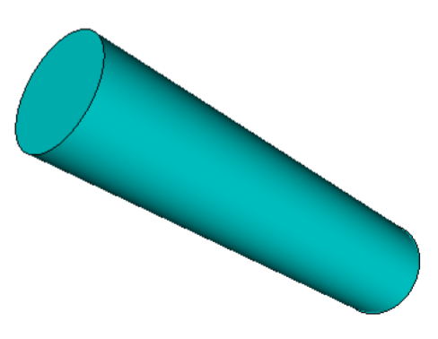
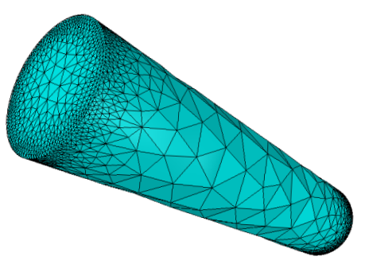
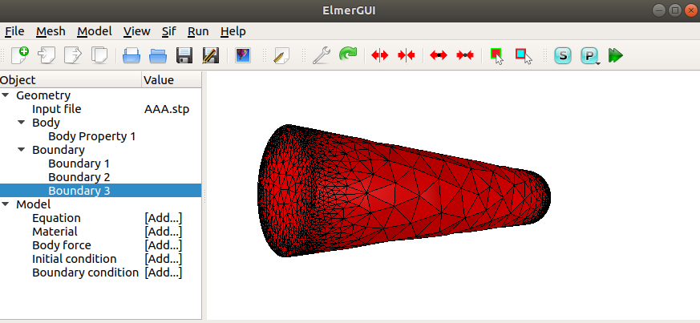
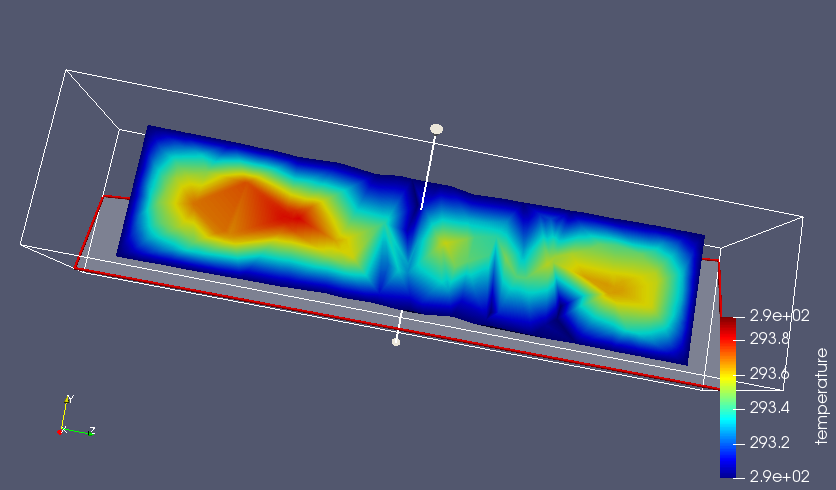

# Simulação Computacional dos Materiais - IFUSP
## Cálculos de elementos finitos utilizando o Elmer, Laboratório 2
Neste tutorial, vamos aprender a fazer a simulação da distribuição de temperatura em uma bateria de Li utilizando o método dos elementos finitos (FEM). O arquivo de entrada que será utilizado nas simulações se encontra no diretório [labFEM2](./) chamado AAA.stp
Iremos utilizar o software [Elmer](http://www.elmerfem.org/blog/), um programa de código aberto muito bem documentado.
### Ajustes na Máquina Virtual
No terminal, tente abrir o software com o comando **ElmerGUI**. Caso o sistema acuse a ausência da biblioteca **libQt5Xml.so.5**, favor re-instalar com o comando:
```bash
sudo apt-get install libqt5xml5
```
### Tutorial -- Distribuição de temperatura em uma bateria de Li
1- No terminal, entre na pasta do curso SCM2020 e depois na pasta LabFEM_2. Ainda no terminal abra o software Elmer com o comando
**ElmerGUI**
**Importando a Geometria (CAD)**
Nesta etapa, iremos importar a geometria da prótese que foi gerada no software Solid Edge, cujas dimensões são mostradas na figura abaixo.
Nesta etapa, também será realizada a discretização da estrutura.

[](media/image1.png)


2- No Elmer, abra o arquivo Cheetah.stp que se encontra na pasta
LabFEM_1

[](media/image2.png)
[](media/image2.png)


3- Clique em Model \> Preferences
@@ -52,7 +52,7 @@ restrict mesh size on surface\...
5- Clique em Apply e feche a caixa ElmerGUI geometry viewer. Agora
clique em remesh para atualizar a malha.

[](media/image4.png)
[](media/image4.png)


**Determinando o Modelo Matemático**
@@ -69,13 +69,13 @@ destacadas abaixo

9- Clique em Edit Solver Settings

[](media/image5.png)
[](media/image5.png)


10- Clique em Linear system \> Selecione Iterative \> GCR e depois
selecione Preconditioning \> ILU1

[](media/image6.png)
[](media/image6.png)


11- Clique em Nonlinear system \> Reduza o número de iterações para 1
@@ -136,7 +136,7 @@ Esta etapa irá ajudar a determinar a direção do carregamento externo
Neste caso, considere zero nas três direções, indicando que alguma parte
da estrutura estará fixa.

[](media/image7.png)
[](media/image7.png)

24- Dê um nome para a condição de contorno

@@ -207,7 +207,7 @@ condições de contorno.

41- Clique em Save and Run para realizar a nova análise

[](media/image9.png)
[](media/image9.png)

### Referências e informações adicionais

0 comments on commit f794ced
Please sign in to comment.

    © 2020 GitHub, Inc.
    Terms
    Privacy
    Security
    Status
    Help
    Contact GitHub
    Pricing
    API
    Training
    Blog
    About
